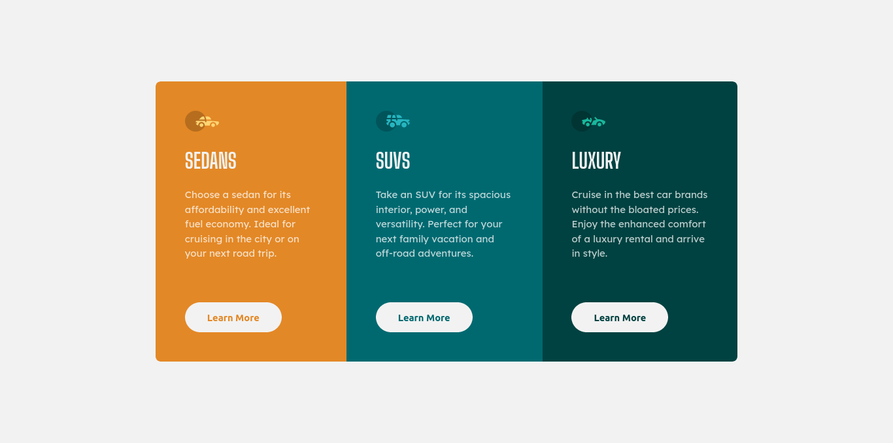

# :star2: Frontend Mentor - 3-Column Preview Card Component :star2:

This is a solution to the [3-column preview card component challenge on Frontend Mentor](https://www.frontendmentor.io/challenges/3column-preview-card-component-pH92eAR2-). Frontend Mentor challenges help you improve your coding skills by building realistic projects.

### :point_right: [Live Site](https://dhawalrath.github.io/3-column-preview-card-component-main/)

## :camera: Overview

## :muscle: Built With

- HTML5 Semantics
- CSS3 (with Grid and Flexbox)
- Mobile-first workflow

## :man: Author

- Frontend Mentor - [@dhawalRath](https://www.frontendmentor.io/profile/dhawalRath)
- Twitter - [@dhawalRath](https://www.twitter.com/dhawalRath)
